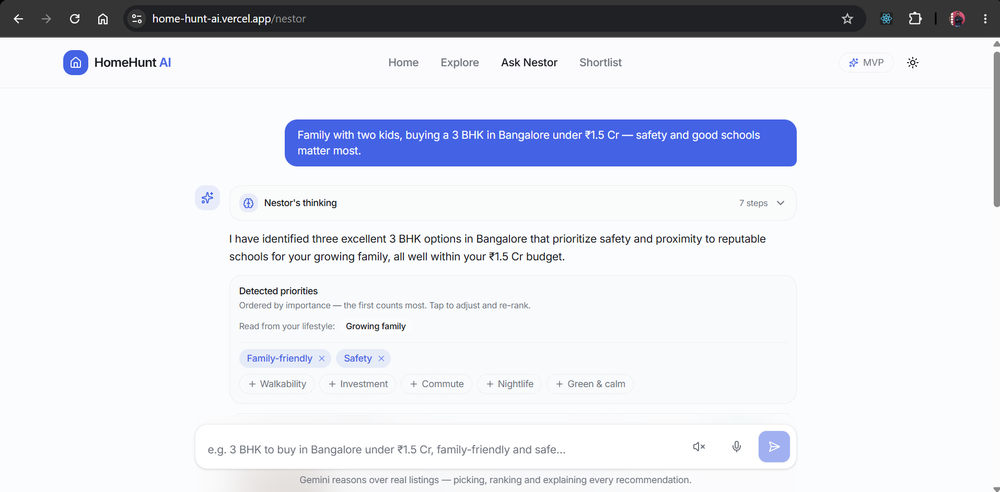
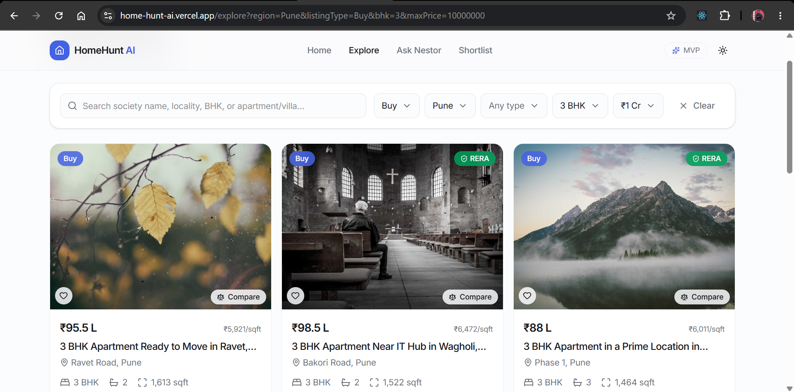
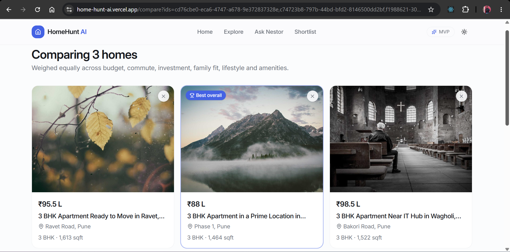
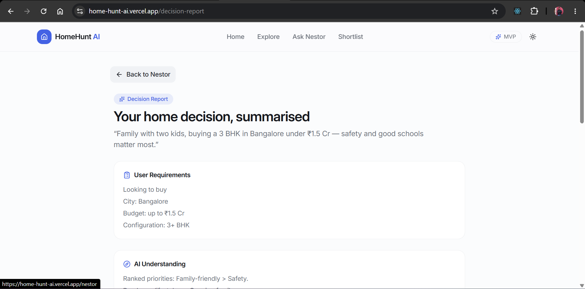

<div align="center">

# 🏡 HomeHunt AI

**Meet Nestor — your AI home decision partner for the Indian property market.**

Describe your life, not filters — HomeHunt AI reads listings, neighborhoods and your
priorities, then helps you decide with confidence instead of spreadsheets.

[**🚀 Live Demo →**](https://home-hunt-ai.vercel.app/)

[](https://react.dev)
[](https://www.typescriptlang.org)
[](https://vite.dev)
[](https://tailwindcss.com)
[](https://supabase.com)
[](https://ai.google.dev)
[](https://vercel.com)
[](https://playwright.dev)

</div>

---

## 📖 Overview

Property portals hand you filter dropdowns and a spreadsheet. HomeHunt AI is built on the
opposite premise: **a home is a decision, not a query.**

You tell Nestor something like *"We're expecting our first baby and I work remotely —
need a peaceful 3 BHK to buy in Bangalore under ₹1.8 Cr"*, and it extracts a structured
search intent, ranks homes by weighted **fit** against locality-level AI scores, and explains
every pick — why it fits you, what you're trading off, what the confidence is grounded in,
and which strong homes *just* missed and why.

The app covers four Indian markets — **Bangalore**, **Hyderabad**, **Delhi NCR** and **Pune** —
across 2,000 listings.

> [!NOTE]
> All listings are **fictional**. Builders, projects, addresses, prices and contacts are
> invented. Only localities and nearby landmarks (metros, tech parks, malls, hospitals,
> schools) are real places, with pricing and scores tuned to realistic market bands.

---

## ✨ Key Features

### 🤖 Ask Nestor (`/nestor`)

| Capability | What it does |
| --- | --- |
| **Natural-language briefs** | Free-text intent → listing type, city, ₹ budget (`cr` / `lakh` / `k`), BHK, property type, priorities |
| **Multi-turn memory** | Follow-ups refine the previous search instead of resetting — *"make it cheaper"* (×0.8), *"any city"*, *"I don't want apartments"* |
| **Lifestyle-based search** | Life-stage phrases become priorities automatically — *"expecting a baby"*, *"my parents will stay with us"*, *"I work remotely"*, *"we have a dog"* |
| **Why this home** | Plain-language strengths drawn from *your* priorities first — raw scores stay internal |
| **Confidence basis** | Every fit % is grounded in a sentence: top-priority match, budget headroom, and caveats |
| **Near-miss explanations** | *"Why weren't these recommended?"* — strong homes that missed by **exactly one** flexible constraint, with the reason |
| **Visual fit meter** | Per-pick breakdown of Budget, Commute, Lifestyle, Family and Investment as 0–100 bars |
| **Editable priorities** | Remove/add priority chips to re-rank in place — no re-parsing |
| **Scope guard** | Off-topic first messages get a redirect instead of ranking the whole catalogue |

### 🏘️ Search & Decide

- **Explore** (`/explore`) — responsive card grid with server-side filters (search, Buy/Rent, city, type, BHK, max price), URL-synced so any search is shareable and survives refresh, loading skeletons, empty/error states, "Load more" paging (24/page).
- **Property detail** (`/property/:id`) — image gallery, key specs, description + highlights, amenities, nearby landmarks, and a sticky sidebar with price, agent contact (`tel:`/`mailto:`) and neighborhood intel score bars.
- **Compare** (`/compare`) — 2–3 homes side by side, scored across Budget, Commute, Investment Potential, Family Friendliness, Lifestyle Fit and Amenities, with a **"Best overall"** winner, reasoning paragraph and runner-up notes.
- **Shortlist** (`/shortlist`) — heart any home; persisted to `localStorage` with a live count badge in the nav.
- **Decision Report** (`/decision-report`) — a structured write-up of any Nestor answer: User Requirements, AI Understanding, Top Recommendation, Strengths, Trade-offs, Alternative Options, Final Recommendation.
- **Nestor → Explore hand-off** — every answer maps its intent onto Explore's filters via URL query params.

### 🎨 Experience

- Light/dark theming with no flash-of-wrong-theme (dark by default)
- Mobile bottom tab bar + floating compare tray
- Route-level code splitting (initial JS ~766 KB, down from ~6 MB)
- Framer Motion transitions, accessible labels, verified by an automated axe-core scan

---

## 🛠️ Tech Stack

| Layer | Technology |
| --- | --- |
| **Frontend** | React 19, TypeScript 6, Vite 8 |
| **Styling** | Tailwind CSS v4, `tw-animate-css`, CVA, `tailwind-merge`, Radix Slot, Lucide icons |
| **Routing** | React Router 7 (`createBrowserRouter`, lazy routes) |
| **Data fetching** | TanStack Query 5 |
| **Forms & validation** | React Hook Form + Zod 4 (`@hookform/resolvers`) |
| **Animation / theming** | Framer Motion, `next-themes` |
| **Database** | Supabase PostgreSQL (RLS, indexed filters) |
| **Backend logic** | Supabase Edge Functions (Deno) |
| **AI** | Google Gemini Flash via `@google/genai` |
| **Hosting** | Vercel (frontend) + Supabase (backend) |
| **Testing** | Playwright + `@axe-core/playwright` |
| **Linting** | Oxlint |

---

## 🏗️ Architecture Overview

```
┌──────────────────────────────────────────────────────────────┐
│  Browser — React 19 SPA (Vercel)                             │
│                                                              │
│  Explore / Detail / Compare / Shortlist                      │
│        └── TanStack Query ──► api.ts ──────────┐             │
│                                                │             │
│  Nestor                                        │             │
│    1. isLikelyOutOfScope()  ── local gate ─────┤ (no network)│
│    2. deriveIntentAsync()  ────────────┐       │             │
│    3. rank + explain (reasoning.ts)    │       │             │
│         deterministic, local seed      │       │             │
└────────────────────────────────────────┼───────┼─────────────┘
                                         │       │
                    ┌────────────────────▼──┐    │
                    │ Supabase Edge Function│    │
                    │   `nestor-intent`     │    │
                    │  • rate limit (30/hr) │    │
                    │  • Gemini Flash       │────┼──► Google Gemini API
                    │  • JSON schema output │    │
                    └───────────────────────┘    │
                                                 │
                    ┌────────────────────────────▼─┐
                    │ Supabase Postgres            │
                    │  • properties (2,000 rows)   │
                    │  • nestor_requests           │
                    └──────────────────────────────┘
```

**The core design decision:** Gemini handles **natural-language understanding only**.
Ranking, fit scoring, strengths, trade-offs, confidence text, near-misses and the Decision
Report are **deterministic TypeScript** — the same intent always produces the same,
defensible answer, and nothing about a recommendation is hallucinated.

Three layers of graceful degradation:

1. **Local scope gate** — off-topic first messages never reach the network.
2. **Local regex parser** — if the edge function or Gemini fails (outage, rate limit, network error), `deriveIntentAsync` silently falls back to `parseIntent`/`refineIntent`. A Gemini outage degrades quality, never breaks Nestor.
3. **Rate limiting** — 30 Gemini calls/hour per caller IP, logged in `nestor_requests`; the check itself fails open.

> [!IMPORTANT]
> Explore, detail, compare and shortlist read **live Supabase data**. Nestor's ranking
> engine (`reasoning.ts`) still ranks against the **bundled local seed** (`listings.json`) —
> the same data, but a static snapshot and a second source of truth. Unifying this is on the
> roadmap.

---

## 🧠 AI Capabilities

### Intent extraction — `supabase/functions/nestor-intent`

A Deno edge function calling **Gemini Flash** (`gemini-flash-lite-latest`) with a constrained
`responseSchema`, `temperature: 0` and `maxOutputTokens: 512`, so output always matches the
`NestorIntent` shape the frontend expects.

It extracts: `listingType`, `region`, `maxPrice`, `minBhk`, `propertyType`,
`excludedPropertyTypes`, `priorities` (ordered, most important first), `lifestyleTags`,
`changed` (did this follow-up change anything?) and `offTopic`.

Notable inferences the prompt encodes:

- **Buy vs. Rent from the price unit** — lakh/crore implies a sale price → **Buy**; bare thousands (`45k`) implies monthly rent → **Rent**. An explicit "buy"/"rent" word always wins.
- **City aliases** — Bengaluru/BLR, Hyd/Cyberabad, Gurugram/Noida/Ghaziabad → Delhi NCR, PCMC → Pune.
- **Life-stage → priorities** — nine mapped patterns (retiring, newly married, single professional, growing family, investor, expecting, multigenerational, remote/WFH, pet owner).
- **Follow-up merge semantics** — explicit values override; relative nudges scale the budget; negations add exclusions; newly named priorities move to the front; everything unmentioned carries over.

### Deterministic reasoning — `src/features/nestor/reasoning.ts`

Ranking is a **weighted fit score** over seven locality dimensions carried on every listing
(`walkability`, `familyScore`, `investmentScore`, `commuteScore`, `safetyScore`,
`nightlifeScore`, `greenScore`). The first-named priority gets the highest weight
(`weight = n - i`); ties break on cheaper price-per-sqft.

If too few homes match, **progressive filter relaxation** loosens the cheapest constraint
first — property type → BHK → budget (+25%) → city — until at least 3 homes surface, and the
reply says which filters were widened.

---

## 📁 Project Structure

```
HomeHuntAI/
├── src/
│   ├── app/
│   │   ├── router.tsx              # Routes + React.lazy code splitting
│   │   ├── root-layout.tsx         # Header, mobile tab bar, compare tray, Suspense
│   │   ├── providers.tsx           # Theme, Query, Compare, Shortlist providers
│   │   └── not-found-page.tsx
│   ├── components/
│   │   ├── theme-toggle.tsx
│   │   └── ui/                     # button.tsx, score-bar.tsx
│   ├── features/
│   │   ├── home/
│   │   │   └── home-page.tsx       # Marketing hero + feature cards
│   │   ├── nestor/
│   │   │   ├── nestor-page.tsx     # Chat UI, PickCard, priority editor
│   │   │   ├── reasoning.ts        # ⭐ Intent + ranking + explanation engine
│   │   │   ├── fit-meter.ts        # Per-pick 0–100 breakdown bars
│   │   │   ├── decision-report.ts  # Structures an answer into a report
│   │   │   └── decision-report-page.tsx
│   │   └── properties/
│   │       ├── api.ts              # ⭐ Supabase queries + row → domain mapping
│   │       ├── queries.ts          # useProperties / useProperty / usePropertiesByIds
│   │       ├── types.ts            # ⭐ Zod schema — single source of truth
│   │       ├── comparison.ts       # Deterministic side-by-side scoring
│   │       ├── filter-params.ts    # Filter ⇄ URL query params
│   │       ├── compare-context.tsx     # Compare selection (max 3, localStorage)
│   │       ├── shortlist-context.tsx   # Shortlist (localStorage)
│   │       ├── explore-page.tsx / property-detail-page.tsx
│   │       ├── compare-page.tsx / shortlist-page.tsx
│   │       ├── components/         # property-card, filter-bar, compare-tray
│   │       └── data/               # listings.json (2,000 seed listings)
│   ├── lib/
│   │   ├── supabase.ts             # Supabase browser client
│   │   ├── query-client.ts
│   │   ├── use-document-title.ts   # Per-route SEO titles
│   │   └── utils.ts                # cn, formatINR, joinClauses
│   └── styles/globals.css          # Tailwind v4 + design tokens
├── supabase/
│   ├── functions/nestor-intent/    # ⭐ Deno + Gemini edge function
│   └── migrations/
│       ├── 0001_create_properties.sql
│       ├── 0002_create_copilot_requests.sql
│       └── 0003_rename_copilot_requests_to_nestor.sql
├── scripts/
│   ├── generate-listings.mjs       # Deterministic seed generator
│   └── migrate-to-supabase.mjs     # One-off seed → Postgres migration
├── tests/                          # 11 Playwright specs (390 runs)
├── vercel.json                     # SPA rewrite
└── vite.config.ts
```

### Routes

| Route | Page |
| --- | --- |
| `/` | Marketing home |
| `/explore` | Filterable listing grid |
| `/property/:id` | Property detail |
| `/compare` | Side-by-side comparison (`?ids=a,b,c`) |
| `/shortlist` | Saved homes |
| `/nestor` | Ask Nestor |
| `/decision-report` | Structured report for a Nestor answer |
| `*` | 404 |

---

## 📸 Screenshots

> _Replace the placeholders below with real captures._

| Nestor | Explore |
| --- | --- |
|  |  |

| Compare | Decision Report |
| --- | --- |
|  |  |

<p align="center"></p>

---

## 🚀 Installation & Local Setup

### Prerequisites

- **Node.js 20.6+** (the migration script uses `node --env-file`)
- A **Supabase** project — [supabase.com](https://supabase.com) (free tier is fine)
- A **Google Gemini API key** — [aistudio.google.com/apikey](https://aistudio.google.com/apikey)

### 1. Clone and install

```bash
git clone https://github.com/shivrajpro/HomeHuntAI.git
cd HomeHuntAI
npm install
```

### 2. Configure environment

```bash
cp .env.example .env
```

Fill in the values from your Supabase dashboard (**Settings → API**):

| Variable | Where it's used | Notes |
| --- | --- | --- |
| `VITE_SUPABASE_URL` | Browser (`src/lib/supabase.ts`) | Your project URL. Safe to expose. |
| `VITE_SUPABASE_ANON_KEY` | Browser | The `anon` public key. Safe to expose — RLS restricts it to reads. |
| `SUPABASE_SERVICE_ROLE_KEY` | `scripts/migrate-to-supabase.mjs` only | ⚠️ **Bypasses RLS.** Never prefix with `VITE_`, never expose to the frontend, never commit. |
| `GEMINI_API_KEY` | Edge function secret (see below) | Set via the Supabase CLI, **not** in `.env`. |

> `.env` is git-ignored. `.env.example` holds blank placeholders only.

The app throws on startup if `VITE_SUPABASE_URL` or `VITE_SUPABASE_ANON_KEY` are missing.

---

## 🗄️ Database Setup & Seeding

### 1. Create the tables

Run all three migrations in the Supabase dashboard's **SQL Editor** (in order):

1. `supabase/migrations/0001_create_properties.sql` — the `properties` table, filter indexes, RLS with a public read-only policy.
2. `supabase/migrations/0002_create_copilot_requests.sql` — the rate-limit log (RLS enabled, no policies — only the edge function's service-role key touches it).
3. `supabase/migrations/0003_rename_copilot_requests_to_nestor.sql` — renames that table to `nestor_requests`, following the rename of the assistant to Nestor. 0002 still creates the table under its old name because it was already applied to the live database; the rename is a forward migration rather than an edit to history.

### 2. Load the seed

```bash
npm run migrate:supabase
```

This pushes all 2,000 listings from `src/features/properties/data/listings.json` into Postgres
using the service-role key. Verify with `content-range: 0-0/2000` from the REST API.

### About the seed data

**2,000 fictional listings — 500 per market**, shaped like a real portal:

| Market | Sample localities |
| --- | --- |
| **Bangalore, Karnataka** | Electronic City, Whitefield, Sarjapur Road, HSR Layout, Koramangala, Indiranagar |
| **Hyderabad, Telangana** | Gachibowli, Kondapur, Madhapur, Financial District, Kokapet, Banjara/Jubilee Hills |
| **Delhi NCR** | Noida (Sec 150/137/76), Greater Noida West, Dwarka, Gurugram (Golf Course Rd, Sohna Rd), Ghaziabad, Faridabad |
| **Pune, Maharashtra** | Hinjewadi, Wakad, Baner, Balewadi, Kharadi, Hadapsar, Viman Nagar, Koregaon Park, Aundh |

Distribution: **1,492 Buy / 508 Rent** · **1,336 Apartments**, 216 Independent Houses,
181 Villas, 177 Builder Floors, 90 Plots. Every listing carries seven locality AI scores plus
pricing, areas, RERA status and amenities tuned to real market bands. The shape is defined and
validated by the Zod schema in `src/features/properties/types.ts`.

### Regenerating the seed

The generator uses a seeded PRNG, so re-running produces an identical file:

```bash
npm run seed
```

Edit locality bands, landmarks or distributions in [`scripts/generate-listings.mjs`](scripts/generate-listings.mjs).

---

## ▶️ Running the Application

```bash
npm run dev       # Dev server → http://localhost:5173
npm run build     # tsc -b && vite build
npm run preview   # Preview the production build
npm run lint      # Oxlint
```

### Deploying the edge function

Nestor's Gemini parsing needs the `nestor-intent` function deployed:

```bash
npx supabase login
npx supabase link --project-ref <your-project-ref>
npx supabase secrets set GEMINI_API_KEY=<your-gemini-key>
npx supabase functions deploy nestor-intent
```

This function was previously named `copilot-intent`. Renaming it in the repo does **not** rename
the deployed function, so an existing project needs the new one deployed and the old one removed:

```bash
npx supabase functions delete copilot-intent
```

`SUPABASE_URL` and `SUPABASE_SERVICE_ROLE_KEY` are auto-populated by the Edge Function
runtime — no manual config needed. Dependencies resolve at deploy time via `npm:` specifiers,
so there's no separate install step.

> Without this, Nestor still works — it falls back to the local regex parser.

### Tests

```bash
npx playwright test              # 390 runs — 65 tests × 6 browser/device projects
npx playwright test --ui         # Interactive mode
npx playwright show-report       # Last HTML report
```

Coverage spans every route, filters and search, Nestor (including Gemini-outage and
rate-limit fallback), compare, shortlist, theming, 404s, per-page SEO titles, and an automated
**axe-core accessibility scan**. Projects: Chromium, Firefox, WebKit, iPad Mini, Pixel 5,
iPhone 12. The config auto-starts the dev server.

---

## ☁️ Deployment

**Live at [home-hunt-ai.vercel.app](https://home-hunt-ai.vercel.app/)**

| Piece | Host |
| --- | --- |
| React SPA | Vercel |
| Postgres + Edge Functions | Supabase |
| Gemini API | Google AI |

Vercel setup:

1. Import the repo at [vercel.com/new](https://vercel.com/new) — Vite is auto-detected (`npm run build` → `dist`).
2. Add `VITE_SUPABASE_URL` and `VITE_SUPABASE_ANON_KEY` under **Settings → Environment Variables**.
3. Deploy.

[`vercel.json`](vercel.json) rewrites all paths to `/index.html` so client-side routes deep-link
correctly on refresh.

> Only `VITE_`-prefixed vars belong in Vercel. The service-role key stays local; the Gemini key
> lives in Supabase secrets.

---

## 🔌 API & AI Integrations

| Integration | Purpose |
| --- | --- |
| **Supabase PostgREST** (`@supabase/supabase-js`) | All listing reads. Filters (`region`, `listing_type`, `property_type`, `bhk`, `price`) run server-side as query predicates; free-text search uses `.or()` + `ilike` across title, locality, sub-locality, city and project name. Rows are mapped snake_case → camelCase and validated through `propertySchema.parse` so bad data fails loudly. |
| **Supabase Edge Functions** | Hosts `nestor-intent` (Deno). CORS-enabled, `POST { rawText, prevIntent }` → `{ intent, refined, offTopic }`. Input capped at 500 chars. |
| **Google Gemini** (`@google/genai`) | Natural-language intent extraction with a constrained JSON `responseSchema`. Server-side only — the API key never reaches the browser. |

**Data flow for one Nestor turn:**

```
brief → isLikelyOutOfScope? ──yes──► redirect reply (no network)
             │no
             ▼
   nestor-intent (rate limit → Gemini → JSON)
             │
        ok ──┴── fail ──► local regex parser (parseIntent / refineIntent)
             ▼
   NestorIntent → selectCandidates → fitScore → strengths
                 → tradeoff → confidence → near-misses → NestorAnswer
```

---

## 🗺️ Future Roadmap

Not yet implemented — tracked in [`project-stage.md`](project-stage.md):

- **Performance** — Nestor's ~5.1 MB listings chunk still loads in one shot on first visit to `/nestor`. Options: fetch the JSON as a static asset, or have Nestor query Supabase directly.
- **Unify Nestor's data source** — retire the local seed snapshot so ranking reads live Supabase data, removing the second source of truth.
- **Full Gemini reasoning** — let Gemini reason over candidate listings end-to-end, rather than parsing intent only.
- **Supabase Storage** — real uploaded property imagery.
- **Smaller polish** — a shortlist heart on Nestor's pick cards; bulk-clearing the shortlist; a drawer if mobile nav outgrows 4 tabs.

---

## 🤝 Contributing

1. Fork and branch off `master` (`git checkout -b feature/your-feature`).
2. Follow the existing structure — features live in `src/features/<domain>/`, shared UI in `src/components/ui/`.
3. `src/features/properties/types.ts` is the **single source of truth**. Change the Zod schema first; types are inferred from it.
4. Keep Nestor's ranking **deterministic**. Gemini parses intent; it does not rank.
5. Before opening a PR:

   ```bash
   npm run lint          # Oxlint
   npm run build         # tsc -b && vite build
   npx playwright test   # E2E + accessibility
   ```

6. Update [`project-stage.md`](project-stage.md) and this README if your change affects documented behavior.

> One standing lint warning is pre-existing in `src/components/ui/button.tsx`.

**Never commit** `.env`, the service-role key, or the Gemini key.

---

## 📄 License

No license file is currently included, so this project is **All Rights Reserved** by default.
If you intend to open-source it, add a `LICENSE` file (MIT is the common choice) and update
this section.

---

<div align="center">

Built for the **OpenAI × NamasteDev Codex Hackathon** ·
[Live Demo](https://home-hunt-ai.vercel.app/) ·
[Repository](https://github.com/shivrajpro/HomeHuntAI)

</div>
